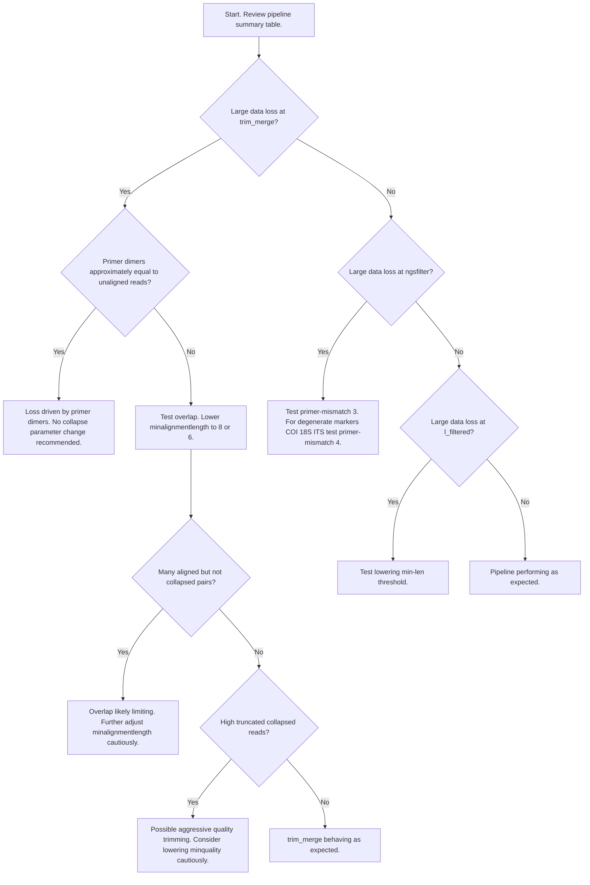

<p align="center">
  
</p>

---

DOI 

Created by Eric Garcia, Trevor Nishida and Jonathan Whitney

**RAMeN**: Regionally-curated, Adaptable, Multi-locus, eDNA, aNalysis pipeline, is a versatile, end-to-end pipeline providing curated eDNA metabarcoding analyses across single or multiple loci. The framework consists of three modular components featuring automated scripts that streamline the user experience. These modules allow users to assess dataset integrity, evaluate pipeline performance, curate taxonomic assignments, and visualize comprehensive analyses of metabarcoding results. By combining a containerized workflow for metabarcoding with R-based curation and analysis modules, RAMeN is highly accessible and operational on both local machines and high-performance computing (HPC) clusters. Furthermore, each module functions independently, giving users the flexibility to utilize the full pipeline or integrate their own pre-processed data into specific modules.

 
**Citation:**
```
Garcia, E., Nishida T., Whitney J. RAMeN: Regionally-curated, Adaptable, Multi-locus eDNA aNalysis pipeline (2026)
``` 

<details><summary>Required software</summary>
<p>

Metabarcoding Module:
 
* [rainbow_bridge](https://github.com/mhoban/rainbow_bridge) 
   * The main dependencies are **Nextflow** and **Singularity** but see rainbow_bridge documentation for a complete list.
* R packages: tidyverse, patchwork, scales, reshape2, viridis

Remix Module:

* R packages: tidyverse, broom, knitr, svDialogs, worrms, phyloseq

Analysis Module

* R packages: tidyverse, circlize, MicrobiotaProcess, phyloseq, ggtree, ggtreeExtra, ggstar, vegan, 
  
---

</p>
</details>


&nbsp;
&nbsp;

---

## Workflow

<p align="center">
  
</p>

| RAMeN modules | Main functions |
| --- | --- |
| Metabarcoding Module | Initial processing of sequence files, QC, metabarcoding analysis, and first overview of dataset and pipeline performance |
| Regional Remix Module |  Curation of metabarcoding results, synonym resolution, and cross reference taxonomic assignments with a regionally curated species list | 
| Analysis Module | Analysis of diversity, community composition, spatial distributions and more. Visualization for single and multi-dimension data (multi-marker) and metadata (multivariable) | 

&nbsp;

---

## Metabarcoding Module

This module utilizes the command line to set up your project and generate main metabarcoding results via `rainbow_bridge`. Rscripts are then used to  create the first overview of results. These results will be refined and curated in the following module:

Two reports will be generated:

* *Preprocessing Report (PDF)*
* *Metabarcoding Report (PDF)*

Use these reports to assess the integrity of your dataset, pipeline success, and whether subsequent runs with tailored parameters are neeed for your project. Once you are content with the pipeline and dataset performance, generate the output needed for the following module, the `regional_remix`

### Running rainbow_bridge

<details><summary>rainbow_bridge info</summary>
<p>

The metabarcoding processing in RAMeN is performed via [rainbow_bridge](https://github.com/mhoban/rainbow_bridge?tab=readme-ov-file#specifying-demultiplexing-strategy,) a flexible pipeline for eDNA and metabarcoding analyses. `rainbow_bridge` can process raw or already filtered sequences from single- or paired-end datasets to create zero-radius operational taxonomic units (zOTUs), abundance tables, and assign taxonomy (via [BLAST](https://blast.ncbi.nlm.nih.gov/Blast.cgi) and/or [insect](https://github.com/shaunpwilkinson/insect)) along with converging to the lowest common ancestor (LCA). 

The execution of rainbow_bridge requires `Nextflow` a containerized environment (`Singularity/Podman`). Refer to rainbow_bridge documentation for installation details.  You may test the success of `rainbow_bridge` installation using their [test repository](https://github.com/mhoban/rainbow_bridge-test).

</p>
</details>

<details><summary>Organization and Project Info</summary>
<p>

**Organization**

We recommend giving every project a separate GitHub repository that can be treated a stand alone product. For example, for multi-marker projects, set up a separate repo for each marker and then an additional repo for the multi-marker analyses that will combine them.

* Create a GitHub repo or *home_dir* for your project

**Project Info**

Create a `project_info.tsv` file at the base of your project to populate metadata in subsequent reports.

Below is example project metadata that can be reported in your project but feel free to add or remove info as needed.

From you project's home directiory, create project info file with:
```
echo -e "Project Title\tUsing multi-marker eDNA metabarcoding to characterize pelagic ecosystem species composition in the Central North Pacific" > project_info.tsv
echo -e "Cruise\t2022 Pacific Cruise (SE2204)" >> project_info.tsv
echo -e "Location\tCental Pacific, multiple latitudes" >> project_info.tsv
echo -e "Samples\t227 Initial samples (unique filtes) with no filter replicates" >> project_info.tsv
echo -e "Genetic marker\tCOI" >> project_info.tsv
echo -e "Pipeline used\tRAMeN" >> project_info.tsv
echo -e "Reference Database\tMidori2 2026-04-07_sp_uniq_COI" >> project_info.tsv
echo -e "Analyses done by\tname (email)" >> project_info.tsv
echo -e "Institution information\tAffiliation" >> project_info.tsv

```

---

</p>
</details>

<details><summary>Get your Data</summary>
<p>

**Data Files**

Make data subdir and place your data files inside
```
mkdir home_dir/data
cp <files> home_dir/data
```

**Rename Data Files**

Rename your files to something managable as downstream analysis will use the names in the output.

For example, a sequencing facility might provide a naming scheme for data files that looks like:
```
JV216.2_UniCOI_username_S041036.1.R1.fastq.gz
```
Where the `S041036` is the actual sample name, the `.1` after that represents the replicate, the `R1` represent foward reads, and the rest is information not needed for processing. 

In this case, all relevant information can be included within a short name as "S041036.1.R1.fastq.gz"

**Metadata**

If you have any metadata, this is a good time to extract that info.

Create the file `sample_site_rep.tsv` with sample as the first column, site (or other grouping metadata), and replicate (number of file withing the previous grouping)

Example:
```
sample  site    replicate
S045200 AD_1    1
S045201 AD_1    2
S045202 AD_1    3
S045203 AD_1    4
S045196 AD_2    1
S045198 AD_2    3
S045192 AD_3    1
S045193 AD_3    2
S045194 AD_3    3
S045195 AD_3    4
S045188 AD_4    1
S045189 AD_4    2
S045190 AD_4    3
S045191 AD_4    4
S045184 AD_5    1
S045185 AD_5    2
S045186 AD_5    3
S045180 AD_6    1
S045181 AD_6    2
S045182 AD_6    3
S045183 AD_6    4
S045204 AD_ctrl ctrl
S045175 AN_1    1
S045176 AN_1    2
S045177 AN_1    3
```

---

</p>
</details>


<details><summary>Check your Sequence Files</summary>
<p>

Take a momment to review your files:
* is your data demultiplexed?
* are the data single- or paired-end?
	* do you have same number of forward and reverse files?
 * Do you have all the files? were all transfers successful?
 * Check the sizes
 	* do you have consistent number of reads across samples? or a biased distribution?

For convinience, RAMeN includes the script `check_fastq.sh` which checks the:

A) FASTQ format
* Checks that line 1 of each record starts with @
* Checks that line 3 starts with +
* Verifies that the sequence (line 2) and quality (line 4) have equal length.
* Confirms the total number of lines is a multiple of 4 and that the file is not empty

B) GZ format
* Checks that compression (gz) is correct. Problems with this could indicate faulty file downloads or transfers

C) Paired-End (PE) format
* Checks that every sample has the set forward and reverse files, and these have the same number of reads.

D) Creates Read summaries
* Report of read numbers per file
* Summary of read numbers
* Summary of read lengths.

Create a scripts subdir and copy `check_fastq.sh` there. From `home_dir`:
```
mkdir scripts
cp RAMeN/bin/check_fastq.sh scripts
```

Navigate to your data subdir and execute with
```
cd data
# bash RAMeN/bin/check_fastq.sh <path_to_data_files>
bash ../scripts/check_fastq.sh "."
```

You will see a summary of the results printed straight in the standard output, stdout, that looks like this (example using 4 files):
```
🧪 FASTQ Validation Summary
----------------------------
✅ Passed: 4
❌ Failed: 0
📊 Total:  4
🎉 All files passed FASTQ validation.

🧪 GZIP Compression Check
----------------------------
✅ GZIP OK: 4
❌ GZIP Fail: 0
📦 Total Checked: 4
🎉 All files are valid GZIP compressed files.

🧪 Paired-End FASTQ Validation 
------------------------------------------

✅ Pairs OK: 2
❌ Pairs Fail: 0
🔢 Total Pairs Checked: 2
🎉 All paired FASTQ files look properly matched and formatted.

🧪 Generating raw read counts and length analyses
-----------------------------------------------

📄 Read counts written to: fq_format_check_logs/raw_read_count.tsv

📄 Read length summary written to: fq_format_check_logs/raw_read_length_summary.tsv

📄 all output can be found in the subdirectory fq_format_check_logs
```

All the output of the check script is saved into the subdir `fq_format_check_logs`, including lists of "good" and "bad" files, logs of file properties, a read count of both paired-end files in `paired_end_check.log`, and a summary of the counts as well as read lenghts.

In addition, if any file is found to have issues in the format, the script will generated a detailed log for that file as well.

Check all the output for read flags.

Note: this script should work with *[_|.][R1|r1].[fastq|fq].gz and *[_|.][R2|r2].[fastq|fq].gz file extensions. Other extensions will need modification.

---

</p>
</details>

<details><summary>Check Read Content - Sequence Artifacts</summary>
<p>

So far we checked the integrity of the actual files but we have not take a look at the content of the files, the sequences themselves. eDNA Projects often involve samples with low levels of DNA, in such cases the sequencing of eDNA data can incoorporate artifacts. 

The following script checks for primer dimers and other short-read articats based on sequencing adapters. 
```
RAMeN/bin/check_dimers.sh 
```
For instance, in a standard COI metabarcoding run, a valid read should consist of a ~40-50 bp leader sequence (sequencing forward primer/overhangs), followed by the biological insert (the target COI gene, typically ~300–315 bp). Because this total length (~340–365 bp) exceeds standard MiSeq read lengths (e.g., 250 bp or 300 bp), the sequencer will stop reading before it ever reaches the downstream adapter on a valid target.
However, primer dimers occur when the Forward and Reverse primers anneal to each other instead of the target DNA, creating a very short "empty" insert consisting only of the reverse primer (typically ~35–45 bp, depending on the exact COI primers used). Because this artifact is very short, the sequencer reads through the leader, the short dimer "insert," and immediately into the adapter sequence starting around base position 80–90.
The script detects this by flagging any read where the  adapter sequence (for example “CTGTCTCTTAT”) appears within the first 100 base pairs, allowing for rapid quantification of failed reactions across large datasets.

Checking for these artifacts can explain large loss of data in QC steps of metabarcoding pipelines.

**Check for Sequence Artifacts**

Copy this script in your scripts dir:
```
cp RAMeN/bin/check_fastq.sh home_dir/scripts
```

From your data subdir, execute the script with
```
bash ../scripts/check_dimers.sh CTGTCTCTTAT
```
*The script can be used with any other adapter or motif. Modify the adapter/motif as needed. Skip this part if the adapter is not known*

The script will produce:

* primer_dimer_report.tsv: per file report
* average_primer_dimer.tsv: average across files

Later, you will include the average estimation in the QC - Preprocessing Report

---

</p>
</details>

<details><summary>Database</summary>
<p>

RAMeN requires a preformatted reference database such as [NCBI](https://www.ncbi.nlm.nih.gov/nucleotide/) or [MIDORI2](https://www.reference-midori.info/). Here are optional command-line steps to set up MIDORI2 but this step might be skipped if a database is already available.

No reference database is perfect. Results may be influenced by inherent global data gaps, such as the underrepresentation of rare species, research bias toward economically important taxa, and misannotations in the source records. MIDORI2 is a set of publicly accessable, mitochondrial marker or amino acid curated databases (from NCBI GenBank) that mitigate some of these issues. We recommend utilizing MIDORI2 when possible.

We prefer the "sp" "UNIQ" nucleotype database which include sequences that lack species-level assignments ("sp.") and all unique haplotypes associated with each species as well ("UNIQ" portion). RAMeN performs its own taxonomic curation at the regional-remix step. 

**MIDORI2 Setup**

First, download the RAW "sp" "UNIQ" database for the chosen marker.  You'll need the RAW version because rainbow_bridge is not one of the formats already available. 

Make a directory and download the raw file. Example:
```
mkdir 2026-04-07_midori2_sp_uniq_COI
cd 2026-04-07_midori2_sp_uniq_COI
srun wget -c https://www.reference-midori.info/download/Databases/GenBank271_2026-04-07/RAW_sp/uniq/MIDORI2_UNIQ_SP_NUC_GB271_CO1_RAW.fasta.gz
```

Now umcompress the file for the next step:
```
gunzip MIDORI2_UNIQ_SP_NUC_GB271_CO1_RAW.fasta.gz
```

Prep Fasta for makeblastdb

* Midori2 raw fasta files have sequence names with the entire taxonomic information making these to long for the 50 character limit of `makeblastdb`.
* `makeblastdb` also requires a taxid_map file where the read names and NCBI taxonomic ids are provided in the column1 and column2, respectively (tab separated).

Run the script `clean_midori2fasta_for_makeblastdb.sh` to clean the midori2 raw fasta and generates a taxid_map.

Cleanning includes:

1. Keeping only the accession number and species (and sub-species of hybrid) info but it removes extra taxonomic info such as higher taxo-levels.
2. Truncates names to 50 characters
3. Makes the taxid_map file. Luckily the ncbi taxid of each species is given by midori2 already. This script harvest this info.


Move one level about the downloaded database directory:
```
cd ..
```

and execute with:
```
# bash clean_midori2fasta_for_makeblastdb.sh  <input dir> <input_fasta> <output_fasta>
bash RAMeN/bin/clean_midori2fasta_for_makeblastdb.sh 2026-04-07_midori2_sp_uniq_COI MIDORI2_UNIQ_SP_NUC_GB271_CO1_RAW.fasta MIDORI2_UNIQ_SP_NUC_GB271_CO1_RAW_cleanedformakeblastdb.fasta
```
where `input_dir` is the directory with the midori2 file you downloaded, `input_fasta` is the input file name, and `output_fasta` is the "cleaned" output file name, which will be used to make the database

Inspect that the resulting fasta file. See that the names are correctly truncated and have the taxid at the end, etc. For example:
```
>MH910097.1.Paravannella_minima_1443144
ATGGATACCTTGGCATTAAATAAAGAGGACGTAAGTATGCGAAAAGTTACAGGGAGTTTA
ATACTGTGATCTGTAAATTTCCTTGAGTAAACTCATTTAATTTTTTTTCTATTTAATGAA
TTGAAACATCTTAGTAATTAAAAGTAAAATAAATCAAACGAGATTTCATTAGTAGCGGTG
AGCGAATGTGAATTAGGCCTTTTATTTGTATTAATCAGTAGAAAATTTTCGAATAAATTA
...
```

Inspect the taxid_map: see that it contains the same sequence names and taxids separated by a tab. For example:
```
MH910097.1.Paravannella_minima_1443144  1443144
MH535961.1.Vannella_sp._1973054 1973054
MH535965.1.Vannella_sp._1973054 1973054
MH535960.1.Vannella_sp._1973054 1973054
...
```

Then, download the singularity image of the latest version of blastn (.sif executable file):
```
# download and overwrite if .sif exists
singularity pull --force blast_latest.sif docker://ncbi/blast:latest
```

Check that the download worked and check the version:
```
singularity exec blast_latest.sif blastn -version
```

You should see an output similar to:
```
blastn: 2.17.0+
 Package: blast 2.17.0, build Jul 23 2026 18:15:49
```
Make a note of the version in your metadata

Now, use the .sif to make the database:
```
cd 2026-04-07_midori2_sp_uniq_COI

# make database
singularity exec -B "$PWD" ../blast_latest.sif makeblastdb -in MIDORI2_UNIQ_SP_NUC_GB271_CO1_RAW_cleanedformakeblastdb.fasta -parse_seqids -dbtype nucl -taxid_map taxid_map -out midori2_customblast_sp_uniq
```

If this worked ok, you should see a message like:
```
Building a new DB, current time: 07/23/2026 13:12:37
New DB name:   /share/all/midori2_database/2026-04-07_customblast_sp_uniq_COI/midori2_customblast_sp_uniq
New DB title:  MIDORI2_UNIQ_SP_NUC_GB271_CO1_RAW_cleanedformakeblastdb.fasta
Sequence type: Nucleotide
Keep MBits: T
Maximum file size: 3000000000B

Adding sequences from FASTA; added 3003352 sequences in 71.132 seconds.
```

and you should now have files like these:
```
midori2_customblast_sp_uniq.ndb
midori2_customblast_sp_uniq.nhr
midori2_customblast_sp_uniq.nin
midori2_customblast_sp_uniq.njs
midori2_customblast_sp_uniq.nog
midori2_customblast_sp_uniq.nos
midori2_customblast_sp_uniq.not
midori2_customblast_sp_uniq.nsq
midori2_customblast_sp_uniq.ntf
midori2_customblast_sp_uniq.nto
```

Now, check that the database was created correctly:
```
singularity exec -B "$PWD" ../blast_latest.sif blastdbcmd -info -db midori2_customblast_sp_uniq
```

This should give you an output like:
```
Database: MIDORI2_UNIQ_SP_NUC_GB271_CO1_RAW_cleanedformakeblastdb.fasta 
	2,985,458 sequences; 1,927,792,267 total bases

Date: Jul 23, 2026  8:23 PM	Longest sequence: 2,298 bases 

BLASTDB Version: 5 
```
Perfect!!! Now you have a custom database ready for your analyses.

</p>
</details>


<details><summary>Create Supporting Files (barcode, sample_map, and params.yml files)</summary>
<p>

See the [`rainbow_bridge`documentation](https://github.com/mhoban/rainbow_bridge) for details

&nbsp;
&nbsp;

***Making a Barcode file***

The barcode file is used by `rainbow_bridge`to strip barcodes and primer sequences form reads.

*A barcode file is always necessary except for demultiplexed runs where both barcodes and PCR primers have already been removed*

Non- and demultiplexed brief examples:

* Non-demultiplexed runs: This format includes forward/reverse sample barcodes and forward/reverse PCR primers to separate sequences into the appropriate samples. Barcodes are separated with a colon and combined in a single column while primers are given in separate columns. For example:

unmuxed_barcode.tsv

| #assay | sample | barcodes | forward_primer | reverse_primer | extra_information |
|---|---|---|---|---|---|
|16S-Fish | B001 | GTGTGACA:AGCTTGAC | CGCTGTTATCCCTADRGTAACT | GACCCTATGGAGCTTTAGAC | EFMSRun103_Elib90
|16S-Fish | B002 | GTGTGACA:GACAACAC | CGCTGTTATCCCTADRGTAACT | GACCCTATGGAGCTTTAGAC | EFMSRun103_Elib90

* Demultiplexed runs: Since sequences have already been separated into samples, this format omits the barcodes (using just a colon, ':' in their place) but includes the primers. For example:

demuxed_barcode.tsv

| #assay |  sample |  barcodes | forward_primer |  reverse_primer | extra_information |
| --- | --- | --- | --- | --- | --- |
| COI | S040713_1 | : | GACCCTATGGAGCTTTAGAC | CGCTGTTATCCCTADRGTAACT |  confirmed in JVB1836-16SDegenerate-testmethods.txt|


&nbsp;
&nbsp;

### PIFSC Primers

To make this file I need the forward and reverse sequences of the primer that was used. For PIFSC data, we stored this information in the file:
```
/home/egarcia/data/pifsc_eDNA_data/pifsc_Metabarcoding_Primers.tsv
```

In this case, I am calling my barcode file `demuxed_barcodes.tsv` because my samples are already demultiplexed. This file then looks like this:

| #assay |  sample |  barcodes | forward_primer |  reverse_primer | extra_information |
| --- | --- | --- | --- | --- | --- |
| COI | S040713_1 | : | GACCCTATGGAGCTTTAGAC | CGCTGTTATCCCTADRGTAACT |  confirmed in JVB1836-16SDegenerate-testmethods.txt|

Where the header line has to start with #, "S040713_1" is the name of a random sample, and ":" is the 
character that must separate the barcodes use to idenfity samples. Since my samples are already 
demultiplex I need only ":". If you don't have demultiplexed samples, your barcode file needs 
one line per sample with unique combinations of barcodes. See `rainbow_bridge`documentation for more details.

You can copy the block below and just change the content for future runs/primers (but make sure you maintain a tsv format). You can also copy the file in SEDNA
```
#assay	sample	barcodes	forward_primer	 reverse_primer	extra_information
COI	S040713_1	:	GACCCTATGGAGCTTTAGAC	CGCTGTTATCCCTADRGTAACT	confirmed in JVB1836-16SDegenerate-testmethods.txt
```

&nbsp;
&nbsp;

***Make a sample.map file***

A `sample.map` file is only needed if you want `rainbow_bridge` to midify the file names. In this case I am using an in-house script to rename files so I don't need a sample map. If you do need to make one then a `sample.map` is a simple text file with the 3 columns: the base name, name of the forward, and reverse files.

Thus, for file names such as:
```
JV183.1_MiFishU_clientsname_S040845.1.R1.fastq.gz
JV183.1_MiFishU_clientsname_S040845.1.R2.fastq.gz
JV183.1_MiFishU_clientsname_S040846.1.R1.fastq.gz
JV183.1_MiFishU_clientsname_S040846.1.R2.fastq.gz
JV183.1_MiFishU_clientsname_S040853.1.R1.fastq.gz
JV183.1_MiFishU_clientsname_S040853.1.R2.fastq.gz
JV183.1_MiFishU_clientsname_S040854.1.R1.fastq.gz
JV183.1_MiFishU_clientsname_S040854.1.R2.fastq.gz
...
```

The sample file can be created with the following commands:
```
cd projects/MiFishU-test/data/					#navigate into your data dir
ls *gz | sed 's/\.R[12].fastq.gz//' | sort | uniq > basenames	#get the base names
ls *R1.fastq.gz > R1names					#get the forward names
ls *R2.fastq.gz > R2names					#get the reverse names
paste basenames R1names R2names > sample.map			#puts all of them together
```

Inspect your `sample.map` files and make sure it looks ok. Mine looks like this:
```
JV183.1_MiFishU_clientsname_S040845.1       JV183.1_MiFishU_clientsname_S040845.1.R1.fastq.gz   JV183.1_MiFishU_clientsname_S040845.1.R2.fastq.gz
JV183.1_MiFishU_clientsname_S040846.1       JV183.1_MiFishU_clientsname_S040846.1.R1.fastq.gz   JV183.1_MiFishU_clientsname_S040846.1.R2.fastq.gz
JV183.1_MiFishU_clientsname_S040853.1       JV183.1_MiFishU_clientsname_S040853.1.R1.fastq.gz   JV183.1_MiFishU_clientsname_S040853.1.R2.fastq.gz
JV183.1_MiFishU_clientsname_S040854.1       JV183.1_MiFishU_clientsname_S040854.1.R1.fastq.gz   JV183.1_MiFishU_clientsname_S040854.1.R2.fastq.gz
...
```

Once you're satisfied, delete the intermediate files
```
rm basenames R1names R2names
```

&nbsp;
&nbsp;

***Making a Parameter yml file***

When running rainbow, you can either include the complete command using flags such as 
```
--paired --reads ../data/ --barcode '../data/*.tsv'
```

Or you can make a yml parameter file where you specified all the setting used by each run. In this file, each flag is place in a new line, removing the initial "--" and placing a column after the name of the flag. Additionally, for flags that do not have an additional argument such as "--paired", you should use "True" or "False". For example:
```
nano data/pared_demuxed.yml
```
```
paired: true
demultiplexed-by: index
reads: ../data/
sample-map: ../data/sample.map
barcode: ../data/demuxed_barcode.tsv
fastqc: true
...
```
There are several parameters sets available. See `rainbow_bridge` README for all of these.

Normally, I would recommend using a params yml file but currently `NEXTFLOW` in SEDNA is not parsing params files so we have to directly modify the flags in the script running `rainbow` for now.

---

</p>
</details>

<details><summary>Execute rainbow_bridge</summary>
<p>

Assuming you have successfully installed all dependencies of `rainbow_bridge`, you should now be ready to generate your metabarcoding results.

Make an "analysis" directory and a subdirectory for each run you do. That is, you might have 
multiple runs with different parameters.

You might use a few paramaters to name your subdirectories so that you can recognize individual runs immediately.

From your home_dir:
```
mkdir analyses
mkdir analyses/blast_90_90_00001_lca_97_97_1000hits_midori2
cd analyses/blast_90_90_00001_lca_97_97_1000hits_midori2
```

Depending on how you have set up `rainbow_bridge` in your system, you might execute directly from GitHub or locally if you cloned the repo. This step can take multiple hours depending on the size of your dataset.


Locally:
```
$ rainbow_bridge.nf -<nextflow-options> --<rainbow_bridge-options>
```
notice a single "-" and double "--" dash for nexflow and rainbow_bridge options, respectively.

Directly from GitHub:
```
$ nextflow run -<nextflow-options> mhoban/rainbow_bridge --<rainbow_bridge-options>
```

We recommend using a sbatch script and the `-params-file` option.

For example:
```
#script
RAMeN/bin/run_rainbow_bridge.sh

# execute rainbow_bridge
sbatch RAMeN/bin/run_rainbow_bridge.sh
```
*Note: To use this script, you will need to modify it to your system's configuration*


Now modify the script directly with the desired parameters. Base script has:
```
nextflow run /home/egarcia/pipelines/rainbow_bridge_unzipfix/rainbow_bridge.nf \
  --maxMemory '185 GB' \
  --paired \
  --demultiplexed-by index \
  --reads ../../data/ \
  --barcode ../../data/demuxed_barcodes.tsv \
  --blast \
  --blast-db '/share/all/midori2_database/2025-03-08_customblast_sp_uniq_16S/midori2_customblast_sp_uniq' \
  --publish-mode copy \
  --alpha 2 \
  --zotu-identity 1 \
  --max-query-results 1000 \
  --primer-mismatch 2 \
  --qcov 0 \
  --percent-identity 0 \
  --evalue 0.1 \
  --lulu \
  --fastqc \
  --collapse-taxonomy \
  --dropped "LCA_dropped" \
  --lca-qcov 70 \
  --lca-pid 70 \
  --lca-diff 1 \
  --taxdump /share/all/ncbi_database/new_taxdump.zip
```


</p>
</details>


### Reviewing Results

<details><summary>Check your Run</summary>
<p>
	
Once your job is done, the first thing to do is to review the stdout or slurm out file and see if your run worked or there were issues.

Inspect the bottom of the stout or use `less` to open your slurm out file. `Nextflow` will report the work done step by step. Thus you might going straigth to the bottom (shirt + G) which will show you the report for all the steps. If the run was successfull, you should see a checkmark in every step. Similar to:
```
executor >  local (4081)
[d7/f7024d] unzip (1011)          | 1016 of 1016 ✔
[78/a72092] fix_barcodes (1)      | 1 of 1 ✔
[cf/83c064] first_fastqc (433)    | 508 of 508 ✔
[71/56f697] first_multiqc (1)     | 1 of 1 ✔
[62/eec206] filter_merge (501)    | 508 of 508 ✔
[ac/bf1d37] second_fastqc (508)   | 508 of 508 ✔
[53/4adf8a] second_multiqc (1)    | 1 of 1 ✔
[cf/514d07] ngsfilter (499)       | 508 of 508 ✔
[ea/13025b] filter_length (508)   | 508 of 508 ✔
[c9/d20aeb] relabel (507)         | 508 of 508 ✔
[b2/ce8fbd] merge_relabeled       | 1 of 1 ✔
[26/63bbb8] dereplicate (1)       | 1 of 1 ✔
[3d/2b966b] get_taxdb (1)         | 1 of 1 ✔
[3c/3e86ab] extract_taxdb (2)     | 2 of 2 ✔
[5f/94dd14] blast (1)             | 1 of 1 ✔
[19/843fe8] lulu_blast (1)        | 1 of 1 ✔
[48/a65f44] lulu (1)              | 1 of 1 ✔
[82/f919ea] extract_lineage (1)   | 1 of 1 ✔
[6c/0eaf02] extract_ncbi (3)      | 3 of 3 ✔
[38/7badd5] collapse_taxonomy (1) | 1 of 1 ✔
[54/b238b2] finalize (1)          | 1 of 1 ✔
Completed at: 30-Apr-2025 20:56:03
Duration    : 32m 50s
CPU hours   : 9.4
```

If your slurm looks like this and you can't find errors, then your run worked fine!

In that case, you should see the directories:
* work
* preprocess
* output

&nbsp;
&nbsp;

**ERRORS**

`rainbow_bridge` will hault when encounter an error. If you see an error at the bottom, there is likely another error before this (one error causes others downstream). 

* Scroll up till you locate the first error and throubleshoot that one and then rerun rainbow
	* `rainbow_bridge` does have the ability to run certain steps independently (like collapse_taxonomy).
 	* NEXFLOW also have the `-resume` flag/option which would pick up the processing where the previous run left.

</p>
</details>

<details><summary>rainbow_bridge Output</summary>
<p>

Below is a short description of the output but read the [rainbow_bridge](https://github.com/mhoban/rainbow_bridge) documentation for full details.

Briefly, `rainbow_bridge` will create 3 main subdirectories:
* **work**
  * These are files created by NEXTFLOW (genrally, you don't need to look at these).
  * If you use symlinks, these will direct to one directory withing `work`
* **preprocess**
  * Various intermediate files as filters, trims, etc, are applied to sequence files
  * Here, you can analyze the quality of your dataset and see what filters remove more reads, etc.
  * RAMeN summarises these at a later step in this pipeline     
* **output (this is what you want)**
  * blast
    * reports all the hits per zOTU (within given parameters) in the file `blast_result_merged.tsv`
  * fastqc
    * creates individual qc and multiqc reports before (initial) and after (filtered) preprocessing
  * zOTUs
    * creates zOTUs and reports abundances across samples in the file `zotu_table.tsv`
    * Provides zOTUs actual blasted sequences in the file `*_zotus.fasta`  
    * Provide a list of all unique sequences across samples in the file `*_unique.fasta`
   * lulu
     * Filters dubious zOTUs and creates a new filtered abundance table in `lulu_zotu_table.tsv`
   * taxonomy
     * Puts taxonomic labels to the previous zOTU table
     * Provides all the hits per zOTU that pass your setting in `lca_intermediate.tsv`
     * Chooses the top hit for each zOTU base in a lowest common ancestor (**LCA**) or phylogenetic (**phyloseq**) algorithm
     * If a single zOTU has multiple hits with equal blast results, LCA will collapse the label to the taxonomic level where the assignations are the same for all hits, reported in `lca_taxonomy.tsv` 
    * final
      * puts the various zOTU tables and taxonomy together (and other reports if demanded)
      * `zotu_table_raw.tsv` same as `zotu_table.tsv`
      * `zotu_table_final.tsv` combines `zotu_table.tsv` and `lca_taxonomy.tsv`
      * `zotu_table_final_curated.tsv` combines `lulu_zotu_table.tsv` and `lca_taxonomy.tsv`
     
</p>
</details>

<details><summary>QC and read fate in preprocess (Preprocessing Report)</summary>
<p>

Is time to analyze your results!!! 

First, check how did your dataset fare in the filtering and preprocessing steps.

&nbsp;

**FASTQC Quality Reports**

`rainbow_bridge` generates an "initial" (before preprocessing) and "filtered" (after preprocessing) FASTQC reports 
```
project_dir/output/fastqc/initial/multiqc_report.html
project_dir/output/fastqc/filtered/multiqc_report.html
```

To view these files, download and open them with a web browser.

* Check for any read flags in your dataset

&nbsp;
&nbsp;

**Generate Read Count Summary**

Navigate to the preprocess directory and execute the `read_calculator_rainbow_preprocess.sh` script 
```
cd preprocess
bash RAMeN/bin/read_calculator_rainbow_preprocess.sh
```

* This script creates **read_count_loss_preprocess.tsv** file that reports the number of reads remaning after each step is run as well as the percent of reads loss in each step relative to the previous
* We will then visualize the read fate processing this tsv file with the R script **plot_preprocess_results.R**

If your read calculator worked ok you should see a tsv file that looks like this:

|sample | raw_F | raw_R | trim_merge  |  ngsfilter  |   l_filtered  |  relabeled  |   %_loss_trim_merge  |  %_loss_ngsfilter | %_loss_l_filtered  |   %_loss_relabeled| 
| --- | --- | --- | --- | --- | --- | --- | --- | --- | --- | --- |
|S040713_1  |   84476 | 84476 | 83435 | 83381 | 83381 | 83381 | 1.23 | 0.06 | 0.00 | 0.00| 
|S040713_2  |   69722 | 69722 | 68909 | 68851 | 68851 | 68851 | 1.17 | 0.08 | 0.00 | 0.00| 
|S040715_1  |   76527 | 76527 | 75781 | 75753 | 75753 | 75753 | 0.97 | 0.04 | 0.00 | 0.00| 
|S040715_2  |   48762 | 48762 | 48407 | 48381 | 48381 | 48381 | 0.73 | 0.05 | 0.00 | 0.00|

Review your table and look for read flags or disernable patterns. 

&nbsp;
&nbsp;

**Ploting Read Summary**

Now that you have `read_count_loss_preprocess.tsv` it is time to use R. You can use the following custom Rscript to make plots to visualize and easily identify patterns.
```
RAMeN/bin/plot_preprocess_results.R
```

Download both `plot_preprocess_results.R` and `read_count_loss_preprocess.tsv`, and run the Rscript in your local computer.

**Review:**

* FASTQC Reports
* Preprocessing Report
	
These are the main parameters you might want to modify if you are losing a lot of data during preprocessing steps:


```
--min-quality (default: 20)

Minimum Phred quality score used when trimming low-quality bases from read ends.
Bases with quality ≤ this value are removed before downstream processing.
Higher values = stricter trimming.

When to adjust:

If you see many truncated collapsed reads, consider lowering slightly (e.g., 18–15).

Do not lower aggressively unless quality profiles support it (check FastQC).

--min-align-len (default: 12)

Minimum number of overlapping bases required between R1 and R2 for reads to be merged (collapsed).
Lower values allow shorter overlaps; higher values require stronger overlap evidence.

When to adjust:

If many reads are well aligned but not collapsing, try 8 or 6.

Especially relevant for short amplicons or trimmed reads with reduced overlap.

--min-len (default: 50)

Minimum read length required to retain a sequence after filtering.
Reads shorter than this threshold are discarded.

When to adjust:

If you observe large losses at l_filtered.

If aggressive trimming shortens reads below expected amplicon size.

Lower cautiously (e.g., 40) and confirm biological plausibility.

--primer-mismatch (default: 2)

Maximum mismatches allowed when matching primer sequences during primer removal or demultiplexing.
Higher values allow more variation in primer binding.

When to adjust:

If there is high data loss at ngsfilter.

Try 3, especially for degenerate or variable markers (COI, 18S, ITS).

and/or Try 4 for broad taxonomic amplification (COI, 18S).

Avoid very high values to prevent off-target matches.
```
--- 

Review your preprocess report as it will review the state of your data. You may use the following diagram to guide you in modifying parameters according to the step if which you are losing data:


 

</p>
</details>

<details><summary>Metabarcoding Results (Metabarcoding Report)</summary>
<p>
	
Time to digest the main dish, the metabarcoding results :)

Navigate to your run directory:
```
cd project_dir/analysis/blast_90_90_00001_lca_97_97_1000hits_midori2
```
The metabarcoding results will be in the `output` directory. 

&nbsp;


**Analyse Metabarcoding Results**

RAMeN includes a script that will automatically analyze the main metarbarcoding results.
```
RAMeN/bin/summarize_rainbow_output.R
````

Make a copy of this script and the following `rainbow_bridge` output in the same directory:
```
RAMeN/bin/plot_rainbow_output.R
preprocess/summary-readcount_preprocess.tsv
output/zotus/zotu_table.tsv
output/zotus/*zotus.fasta
output/lulu/lulu_zotu_table.tsv 
output/blast/*/blast_result_merged.tsv 
output/taxonomy/lca/*/lca_intermediate.tsv
output/taxonomy/lca/*/lca_taxonomy.tsv 
output/final/zotu_table_final_curated.tsv

```

Open `summarize_rainbow_output.R` and run the script locally

This will generate the following plots:
* p1_reads_per_init-final_samples.png
* p2_number_of_hits.png
* p3_eval_before_after_filters.png
* p4_pident_qcov.png
* p5_number_of_zotus.png
* p6_number_of_lca_drops.png
* p7_final_taxonomic_diversity.png
* p8_spread_taxonomic_diversity.png
* p9_top10_species.png
* p10_top10_genera.png
* p11_top10_families.png
* p12_top10_orders.png
* p13_top10_classes.png
* p14_top10_phyla.png
* p15_read_count_bins_barplot.png
* p16_read_count_bins_species_summed.png
* p17_species_heatmap.png
* p18_genus_heatmap.png
* p19_family_heatmap.png

**Review:**
* *Metabarcoding Report*

Rerun with different parameters as needed or continue to the next step.

```
### Metabarcoding Results

### READS & HITS

|  |  |
| :--: | :--: |
|Median and distribution of the number of reads (normal and log10 scales) before (Initial) and after preprocessing (Final). Final samples only consider indivials present at the final table: "zotu_table_final_curated.tsv" | Median and distribution of the number of hits per zOTU in the inital Blast and during the LCA process (LCA_intermediate) right before final selection of "best" hit |

### Metrics

|  |  |
| :--: | :--: |
|Median and distribution of the Evalues of hits from inital Blast and during the LCA process (LCA_intermediate) right before final selection of "best" hit | Median and distribution of Percent Identity and Query Coverage of hits from inital Blast and during the LCA process (LCA_intermediate) right before final selection of "best" hit | 


### zOTUs & Ambiguous Taxonomy

|  | |
| :--:|:--:|
| Number of zOTUs per stage | Number hits that have two or more assigment labels with the same highest blast metrics, preventing the algorithm from picking the "best" label at a specific taxonomic level. This level gets an "LCA_dropped" classification and recieves a taxonomic label only at the Lowest Common Ancestor (LCA) or the level where all hits are in concordance | 

### Diversity

|  |  |
|:--:|:--:|
| Number of unique species, genera, families, etc., across all samples and zOTUs. | Median and spread of invernal diversity within each taxonomic level |

 ### Community
 
| |
|:--:|
| |
| |
| |
| Top 10 Most abundant species, genera, families and orders across samples and zOTUs |


|  |  |
|:--:| :--:|
| Most abundant classes across samples and zOTUs | Most abundant phyla across samples and zOTUs |
```


</p>
</details>

### Refining Results

<details><summary>Create input for next module</summary>
<p>

zOTUs (Hereinafter referred to as ASVs) found by `rainbow_bridge` can be matched against a database curated from certain errors like MIDORI2, but mislabelling, taxonomic inconsistencies might prevail. The next module disentangles this discrepancies and validates the regional presence of species and flags foreign taxa.

### Regional Remix

In order to use the regional remix the output from metabarcoding pipelines needs
to be transformed into the format required by the remix script. 

Use the following instructions to generate the input for the Regional Remix from `rainbow_bridge` output. 

**Formatting rainbow_bridge output**

The following script transforms the output of `rainbow_bridge` into the input files for the remix

```
RAMeN/bin/rainbow2remix.sh
```

Make a directory for the Regional Remix within your run subdir and move there
```
mkdir analyses/blast_90_90_00001_lca_97_97_1000hits_midori2/remix
cd analyses/blast_90_90_00001_lca_97_97_1000hits_midori2/remix
```

Copy the the script and the following files from the output of `rainbow_bridge` into the remix dir:
* The final curated zotu table: "zotu_table_final_curated.tsv"
* The LCA intermediate file: "lca_intermediate.tsv"
* The fasta file with the zotu sequences: "<run dir name>_zotus.fasta"

Example:
```
cp ../blast_90_90_00001_lca_97_97_1000hits_midori2/output/zotus/blast_90_90_00001_lca_97_97_1000hits_midori2_zotus.fasta .
cp ../blast_90_90_00001_lca_97_97_1000hits_midori2/output/taxonomy/lca/qcov70_pid70_diff1/lca_intermediate.tsv .
cp ../blast_90_90_00001_lca_97_97_1000hits_midori2/output/final/zotu_table_final_curated.tsv .
```

Execute `rainbow2remix.sh` from the remix directory:
```
bash RAMeN/bin/rainbow2remix.sh rainbow2remix.sh
```

Check the `rainbow2remix-*.out` file and see that the script found all files and generated no errors.

If the script run successfully, it would have generated the `remix_sum.tsv` and `zotu_seqs.tsv` 
which are the two input files for the remix script 

Note: This script will delete the copies of the `rainbow_bridge` output you just made. 
If something goes wrong, you will need to make those copies again.

</p>
</details>

---
## Regional Remix Module
The regional remix algorithm compares metabarcoding results to the relevant regional curated database and flags taxa that would normally be found outside of this region. In addition, the remix removes contamination, normalized read counts, and curates taxonomic assigments of ESVs.
One report will be generated:

* *Remix Report (PDF)*

Use this report to assess the impact of contamination in your dataset, and to understand how well known are the analyzed taxonomic group in the region of interest. 
### Running Regional Remix
<details><summary>regional-remix info</summary>
<p>

**regional-remix** is an R-based post-processing pipeline for eDNA metabarcoding data. It takes raw exact sequence variant (ESV) output from upstream metabarcoding workflows and produces taxonomically validated, contamination-corrected, volume-standardized species detection tables suitable for biodiversity analysis and data archiving.
* This guide documents how the pipeline works and what each stage does.
* When using this pipeline for a new study, create a project-specific README documenting your inputs, settings, and any deviations from defaults.
The pipeline is **configuration-driven**. You edit a single `config.yaml` file, then run one of two entry-point scripts, the scripts will then pull file paths and other data directly from the config file.
Run a single marker:
```
run_pipeline.R          # reads config.yaml, processes the individual marker outlined in the config
```
Run every marker in the run:
```
run_batch.R             # loops over the markers outlined in the batch run section of the config, calling run_pipeline.R per marker
```
The stage modules live in:
```
R/00_import.R -> R/13_viz.R    # sourced automatically by run_pipeline.R
```
Companion QC report:
```
R/Remix-Summary-Doc_AllMarkers_Tabs.Rmd
```
Please read this guide and `config.yaml` fully before running - several study-specific settings must be configured correctly first.
**regional-remix** works with ESV output from the JonahVentures (`JV`) or `rainbow_bridge` (`RB`) upstream metabarcoding pipelines, and supports multiple genetic markers targeting different taxonomic groups.
Supported markers:
| Marker | Target Group |
|---|---|
| `COI-MiFish` | Fishes (12S rRNA) |
| `16SFish` | Fishes (16S rRNA) |
| `COI-Riaz` | Fishes (12S rRNA) |
| `18Sv9` | Eukaryotes |
| `18S_400` | Eukaryotes |
| `COI` | Metazoans |
| `ITS2` | Corals & Sponges |
| `23S` | Algae |
| `16SCeph` | Cephalopods |
| `18SCeph` | Cephalopods |
| `CephMLS` | Cephalopods |
| `MarVer1` | Vertebrates |
| `16SCrust` | Crustaceans |
| `Oordlp4` | Mammals |
| `muCeta` | Cetaceans |
Key features:
* Taxonomic validation via the [World Register of Marine Species (WoRMS)](https://www.marinespecies.org/) API
* Genus-level taxonomy harmonization, plus dedicated Kingdom and Class normalization fixes (`Kingdom = Animalia`, `Class = Teleostei`) that catch genus-only detections the harmonization step can't reach, so a taxon's reads are never split across inconsistent labels
* Percent-identity-based taxonomic resolution capping
* Regional species filtering using a curated local reference list (with a `localFlag` representation code applied to every ESV)
* Known contamination removal (marker-specific and universal) plus marker-specific taxonomic cleanup
* Volume normalization for cross-sample comparability
* Negative control contamination subtraction (ESV-level, volume-standardized, stratified by specified variables when available)
* Large-volume sample flagging and exclusion
* Two-step replicate averaging (PCR replicate → field replicate → site)
* Exports for occupancy modeling, community/biodiversity analysis, Darwin Core occurrence records for [OBIS](https://obis.org/), and a ready-to-use phyloseq object for the following analytical module of RAMeN.
---
</p>
</details>
<details><summary>Required Inputs</summary>
<p>

The following files must be present and correctly formatted before running the pipeline. All paths are configured in `config.yaml` and are relative to the project root (where `run_pipeline.R` lives).
The most critical inputs are the sequencing outputs from either the JonahVentures or `rainbow_bridge` metabarcoding pipelines. Each pipeline has its own output files and they are imported differently (set `pipeline: "JV"` or `"RB"` in `config.yaml`).

**JonahVentures Data** (`inputs/reads-esvs/jonahventures_output/`, set by `inputs$jv_output_dir`):
```
{run}-{marker.full}-read-data.csv     # ESV read counts, wide format (one row per ESV, one column per sample)
{run}-{marker.full}-esv-data.csv      # ESV sequences and taxonomy assignments
```

**rainbow_bridge Data** (`inputs/reads-esvs/rainbow_bridge_output/`, set by `inputs$rb_output_dir`):
***Note: `rainbow_bridge` input goes in its own subdirectory (configured via `inputs$rb_output_dir`).***
```
zotu_table_final_curated_{markerRB}.tsv     # zOTU read counts, wide format (one row per zOTU, one column per sample)
lca_intermediate_{markerRB}.tsv             # Per-BLAST-hit taxonomy table (long format, one row per hit per zOTU)
remix_sum_{markerRB}.tsv                    # Summary table: accession numbers, % identity, sequence, hit counts per zOTU
```
**Field metadata** (`inputs/metadata/`):
```
{metadata_file}.csv                   # Sample metadata (path set by inputs$metadata_file)
{run}-samples-fixed.csv               # Optional JonahVentures sample-ID list (inputs$samples_file); built from metadata if absent
```
**Reference lists:**
```
inputs/contaminants.csv               # Known contaminant taxa (marker-specific and/or universal)
inputs/species-lists/                 # Local fauna cache + study-specific revisions
    HawaiiMarineFaunaList_cache.csv   # Auto-created cache of the regional fauna list (see below)
    {revisions_file}.csv              # Optional taxonomic additions/corrections (inputs$revisions_file)
```
**Regional fauna list (downloaded, not local-by-default):**
The base regional fauna list is fetched from the URL in `config.yaml` (`fauna_url`, default: the [Hawaii Marine Fauna list](https://github.com/trevornishida/HawaiiMarineFauna)) whenever `worms_rerun: true`, and cached to `inputs/species-lists/HawaiiMarineFaunaList_cache.csv`. On subsequent runs with `worms_rerun: false`, the cached copy is reused so the pipeline can run offline. If the download fails and no cache exists, the run stops with instructions.

The optional **revisions file** (`inputs$revisions_file`) supplies study-specific additions or corrections. Only rows where the flag column (`inputs$revisions_flag_col`, default `localFlag_Update`) equals `1` are applied.

**Required metadata columns** (canonical schema - see `inputs/metadata/metadata_template.csv`):
| Column | Description |
|---|---|
| `Sample` | Unique sample identifier |
| `qc_pass` | Quality-control pass flag (`TRUE`/`FALSE`/`1`/`0`/`yes`/`no`); `FALSE` samples are excluded |
| `is_control` | Negative-control flag (`TRUE`/`FALSE` etc.); used to identify procedural blanks |
| `site` | Unique site identifier |
| `site.rep` | Field replicate identifier |
| `latitude` | Decimal latitude |
| `longitude` | Decimal longitude |
**Optional columns** (used when present): `Site.ID` (reporting label; falls back to `site`), `volume` (enables volume standardization), `station`, `day.night`, `depth`, `sta.depth`. Any other columns are carried through automatically as passthrough fields.
</p>
</details>
<details><summary>Configuration (config.yaml)</summary>
<p>

All run settings live in `config.yaml`. Edit the file, save it, then run your desired script. Key fields:
| Field | Purpose |
|---|---|
| `project` | Project label; groups runs under `outputs/{project}/`. Spaces are automatically replaced with underscores when building output paths (e.g. `Pelagic Cruise SE2204` → `Pelagic_Cruise_SE2204`). |
| `run` | Sequencing run ID (e.g. `JVB2899`) |
| `marker_name` | Marker for single-marker runs (`run_pipeline.R`); must be one of the supported markers |
| `batch_markers` | List of markers processed by `run_batch.R`; runs all supported markers by default |
| `pipeline` | Upstream source: `JV` (JonahVentures) or `RB` (rainbow_bridge). Defaults to `RB` when unset, and falls back to `RB` if `JV` is set but no JonahVentures input is found. |
| `worms_rerun` | `true` re-runs the WoRMS API cross-reference and refreshes the fauna cache; `false` reuses cached CSVs (much faster, offline-capable) |
| `apply_regional_filter` | `true` retains only ESVs matching the local fauna list; `false` bypasses the regional semi-join but **still assigns `localFlag`** (see Stage 04) |
| `cutoff_species` / `cutoff_genus` / `cutoff_family` | Minimum % identity for each rank (defaults 97 / 90 / 80) |
| `large_volume_threshold` | Max filtered volume (L) before a sample is set aside as large-volume; `null` disables large-volume exclusion entirely; ignored when metadata has no `volume` column |
| `depth_pad_width` | Pads the `depth` column to this number of digits using leading zeroes. (e.g. `3` depth pad width causes `5` to become `005`); ignored if no `depth` column. Used to maintain order for plotting depth data. |
| `inputs$*` | Paths to metadata, samples, contaminants, and revisions files (`{run}` is substituted at runtime) |
| `obis` | OBIS / Darwin Core export settings - dataset-level Darwin Core defaults, ENVO environment terms, bioinformatics provenance, and per-marker gene/primer metadata; set `obis.enabled: false` to skip. Sample coordinates/dates are read from `inputs$metadata_file`. |
| `fauna_url` | URL for the regional fauna list GitHub repository (fetched fresh on each `worms_rerun`) |
| `output_base` | Output root directory |
If running the pipeline using the command line, you may override the marker without editing the pipeline: `Rscript run_pipeline.R --marker=COI-MiFish` 
---
</p>
</details>

### Remix Stages
The pipeline runs as a sequence of numbered sections inside `run_pipeline.R` (sourced from `R/00_import.R`–`R/13_viz.R`). Six of these sections also save **checkpoint snapshot objects**, which are bundled into `RemixSummaryTables_{marker}.RData` file for the QC report.
<details><summary>Stage 01 - Import & Reference Loading</summary>
<p>

**Import (`00_import.R`).** Raw read-count and ESV taxonomy tables are imported from the JV or RB pipeline and normalized to a common schema: `marker, ESV, sequence, Kingdom through Species, pctMatch, numSpp, run, [sample columns]`. Taxonomy name fields are cleaned to remove common annotation artifacts (e.g. `"sp."` designations blanked, `"cf."` qualifiers stripped, trailing database text removed).

**References (`01_references.R`).** Sample metadata, the contaminant list, and the regional fauna list (+ optional revisions) are loaded. At this stage:
* Samples with `qc_pass = FALSE` are excluded before any processing.
* Duplicate sample IDs are detected and warned.
* Sample columns present in the sequencing output but absent from metadata are reported (`..._samples_excluded_no_metadata.csv`) and dropped. The run stops if **no** samples match the metadata.
* The `localFlagList` / `localFlagList_Family` lookups used for `localFlag` assignment are built from the fauna list.
**Checkpoint objects:**
```r
stage01_rawInput_reads        # full read table after import and name cleaning
stage01_rawInput_esvs         # ESV table after import and name cleaning
stage01_rawInput_sampCount    # number of sample columns
```
---
</p>
</details>
<details><summary>Stage 02 - WoRMS Taxonomic Cross-Reference</summary>
<p>

(`02_taxonomy.R`) All taxonomic assignments are validated against the [World Register of Marine Species (WoRMS)](https://www.marinespecies.org/) using the `worrms` R package. This step:
* Reconciles names to currently accepted valid names
* Resolves taxonomic synonyms

**Taxonomy harmonization.** WoRMS corrections are applied at the species level, so genus-only detections and species not registered in WoRMS keep the taxonomy assigned by the upstream classifier. Three normalization steps run afterward on every pass, including cached (`worms_rerun: false`) runs, so a single taxon is not split across inconsistent labels downstream:

* **Genus higher-rank harmonization.** Each genus is forced to a single `Kingdom` to `Family` classification, taken from that genus's WoRMS-corrected species-level rows (the most frequent path wins on ties). Without this a genus could carry two different higher paths, e.g. *Lampanyctus* as `Animalia / Chordata / Teleostei` from WoRMS versus `Eukaryota / Chordata / Actinopteri` from the classifier, which the rank-aware grouping in the summary/community stages treats as two entities, splitting the taxon's reads across two rows. Genus and species labels are never altered; only the ranks above genus are unified. This step only fixes a genus if at least one of its species-level rows was WoRMS-validated, genera with no species-level anchor (all detections genus-only, or none resolved in WoRMS) are untouched by this step and are instead caught by the two direct fixes below.

* **Animal-kingdom fix.** The upstream classifier frequently labels marine animals with Kingdom `Eukaryota` (a domain, not a kingdom). Rows whose `Phylum` is one of the top-20 marine animal phyla (curated whitelist, e.g. Chordata, Arthropoda, Cnidaria, Porifera, Mollusca) are set to `Kingdom = Animalia`, regardless of genus anchoring. Non-animal phyla (algae, protists, fungi, bacteria) are deliberately excluded so their correct kingdoms (Chromista / Plantae / Protozoa / Fungi / Bacteria) are preserved.

* **Fish-class fix.** The upstream classifier labels ray-finned fish `Class = "Actinopteri"`, while WoRMS' accepted name is `Teleostei`. Same problem as the kingdom fix: genus harmonization alone only rewrites a genus's Class if that genus has a WoRMS-validated species-level anchor, so an unanchored genus in an otherwise-Teleostei order (e.g. *Scombriformes*) could stay labeled `Actinopteri` and get split into a second row by downstream grouping. This fix normalizes both known synonyms (`Actinopteri` / `Actinopterygii`) to `Teleostei` directly, independent of genus anchoring. This assumes all locally-relevant ray-finned fish are teleosts (true for Hawaii's marine fauna - no sturgeon/gar/bichir lineages); revisit if a future dataset includes non-teleost ray-finned fish.
Percent identity thresholds (set in `config.yaml`) cap taxonomic resolution. Assignments that do not meet the threshold for a level are blanked at that level. By default the thresholds are set at:

| Taxonomic Level | Minimum % Identity (default) |
|---|---|
| Species | ≥ 97% |
| Genus | ≥ 90% |
| Family | ≥ 80% |

**Checkpoint objects:**
```r
stage02_wormsCrossRef_reads        # reads after WoRMS validation
stage02_wormsCrossRef_esvs         # ESVs after WoRMS validation
stage02_wormsCrossRef_sampCount    # number of sample columns
```
---
</p>
</details>
<details><summary>Stage 03 - Regional Species Filter</summary>
<p>

(`03_regional_filter.R`) Detections are cross-referenced against the curated regional species reference list. The purpose is to remove or down-rank taxonomic assignments that, while valid in WoRMS, are biogeographically implausible for the study region.
When `apply_regional_filter: true`, ESVs are retained only if they match the local list (semi-join on species, falling back to genus), top regional hits are merged onto the reads, genus is resolved, and the locally-monospecific-genus (LMG) rule promotes species assignments where a genus has exactly one local species. Assignments below the per-rank match thresholds are blanked. When `apply_regional_filter: false`, the semi-join is skipped and all ESVs are retained, but the rest of the stage (including `localFlag` assignment) still runs.
> **When to apply the regional filter.** Enable the regional filter (`apply_regional_filter: true`) when the regional fauna is **well documented** and the reference list is reasonably comprehensive, it then removes biogeographically implausible assignments with high confidence. For taxonomic groups that are **poorly documented** in the region (sparse or incomplete reference lists), consider running with `apply_regional_filter: false`: because the filter drops anything absent from the local list, it can discard legitimate detections that represent **range extensions or new regional records**. With the filter off, `localFlag` is still assigned to every ESV, so out-of-list taxa can be reviewed manually (e.g. `localFlag == 5`) rather than being removed automatically.

> **Note:** This stage operates on the harmonized taxonomy produced in Stage 02 - higher ranks are already unified within each genus, and the fish-class fix means every ray-finned fish row is `Teleostei` by this point, regardless of genus anchoring. The ray-finned-fish `localFlag-4` diagnostic still checks for both `Teleostei` and `Actinopteri` as a defensive fallback, but `Actinopteri` should no longer occur in practice given the Stage 02 fix. Because a genus carries one consistent higher-rank path, downstream site/species grouping does not fragment it across duplicate rows.

**The `localFlag` system.** Every ESV is assigned a `localFlag` value 1–5 recording how it relates to the regional list. This is computed **regardless** of the `apply_regional_filter` setting:
*   1 = Species in local fauna list
*   2 = Genus is locally represented (species blank, or species present but not itself on the local list)
*   3 = Family locally represented, genus blank/unmatched
*   4 = Family locally represented, but species/genus assignment not recorded
*   5 = Not represented locally at any rank

> **Important:** Setting `apply_regional_filter: false` does **not** disable all local filtering. The `localFlag` is still assigned here, and the **localFlag-5 removal happens later in Stage 04** for fish markers (`COI-MiFish`, `16SFish`, `COI-Riaz`), that removal is *not* gated by `apply_regional_filter`. Bypassing the regional filter only skips the semi-join and the regional name re-assignment; it does not retain non-local fish taxa. For non-fish markers, `localFlag` is computed and carried through but is not used for removal.
**Checkpoint objects:**
```r
stage03_regionalFilter            # reads after regional filtering / localFlag assignment
stage03_regionalFilter_sampCount  # number of sample columns
```
---
</p>
</details>
<details><summary>Stage 04 - Post-Filter: Known Contaminants & Marker Cleanup</summary>
<p>

(`04_post_filter.R`) Two things happen here.

**Apply regional assignments (only when `apply_regional_filter: true`).** The regionally-resolved `Species`/`Genus` names computed in Stage 03 are promoted onto the reads. When the filter is bypassed, the original BLAST-derived names are kept instead.

**Marker-specific contamination cleanup.** Each marker routes through its own filter:
* **Fish markers** (`COI-MiFish`, `16SFish`, `COI-Riaz`) drop everything with `localFlag == 5` plus freshwater/terrestrial taxa, and export mammal/marine-mammal hits separately.
* **Cephalopod markers** (`16SCeph`, `18SCeph`, `CephMLS`) keep only `Class == Cephalopoda`.
* **Eukaryote/metazoan markers** (`18Sv9`, `18S_400`, `COI`, `16SCrust`) remove terrestrial invertebrates and humans (and, for `16SCrust`, keep only aquatic arthropods).
* **Algae/plant markers** (`ITS2`, `23S`) remove only humans.
* **`MarVer1`** keeps `Chordata`; **`Oordlp4`** keeps `Mammalia`; **`muCeta`** keeps `Cetacea`.

A user-maintained contaminant file (`contaminants.csv`) is also applied. Its `marker` column controls 
scope:
| `marker` value | Behavior |
|---|---|
| `"universal"` | Applied to all markers |
| `"{marker}"` (e.g. `"COI-MiFish"`) | Applied to that marker only |
| `"blank"` | Listed name is blanked at assignment level; ESV row is retained |

**Checkpoint objects:**
```r
stage04_KnownContam            # reads after contamination removal (reads2)
stage04_KnownContam_sampCount  # number of sample columns
```
---
</p>
</details>
<details><summary>Stage 05 - Reshape, Volume Standardization & Sample Exclusion</summary>
<p>

(`05_reshape.R`) The cleaned wide table (`reads2`) is pivoted to long format and joined to sample metadata. PCR replicates are split out, and read counts are standardized by filtered volume:
```r
read.L = floor(read.count / volume)
```
When the metadata has no `volume` column, standardization is skipped and `read.L = read.count`.
**Large-volume sample exclusion.** Samples filtered through volumes above `large_volume_threshold` (liters) are set aside and archived separately to maintain comparability. Set `large_volume_threshold: null` to disable this entirely.

**Checkpoint object:**
```r
stage06_readsAdjusted             # long-format, metadata-joined table after volume standardization
stage06_readsAdjusted_sampCount
```
---
</p>
</details>
<details><summary>Stage 06 - Negative Control Correction</summary>
<p>

(`06_negcon.R`) Negative field controls (procedural blanks, identified via `is_control == TRUE`) are used to identify and subtract background contamination:
1. For each ESV detected in any negative control, the maximum volume-standardized read count is computed across controls, **stratified by station and day/night when those columns are present**. If only one is present it is used alone; if neither is present, contamination is computed globally per ESV.
2. This maximum is subtracted from all corresponding environmental samples within the same stratum.
3. Adjusted read counts are floored at zero.

```r
read.L.adj = read.L - max.contam    # floored at 0
```
Subtraction diagnostics (which ESVs changed, which detections shifted present→absent) are written to `filtering/`. Negative control samples are removed after correction.

**Checkpoint object:**
```r
stage05_negativeControl           # wide-format read table after negative control subtraction
stage05_negativeControl_sampCount
```

> Stage snapshots and the combined `RemixSummaryTables_{marker}.RData` are written in a dedicated checkpoint section (`run_pipeline.R` Section 08) after negative control correction completes.
---
</p>
</details>
<details><summary>Stage 07 - Replicate Averaging & Spatial Aggregation</summary>
<p>

(`07_averaging.R`) Contamination-corrected reads are aggregated spatially in two sequential steps. Ceiling rounding is applied at each step to avoid fractional read counts.

**Step 1 - PCR replicates → field replicate.** For each ESV, reads are averaged across PCR replicates within each field replicate (`site.rep`). The number of PCR replicates with a positive detection is recorded (`Npcr`) as a detection-confidence metric.
```r
reads2.stl.met.siterep <- reads2.stl.met %>%
  group_by(ESV, site.rep, ...) %>%
  summarise(read.mean = ceiling(mean(read.L.adj)),
            Npcr      = sum(read.L.adj > 0))
```

**Step 2 - Field replicates → site.** Field replicate means are averaged to site-level estimates:
```r
reads2.stl.met.site <- reads2.stl.met.siterep %>%
  group_by(ESV, site, ...) %>%
  summarise(read.mean = ceiling(mean(read.mean)))
```
---
</p>
</details>
<details><summary>Stages 08–12 - Summaries, Community Matrices, Occupancy, OBIS, Phyloseq</summary>
<p>

* **Summaries (`08_summaries.R`)** - per-sample and per-site read summaries plus master species/genus/taxa lists with site frequency and richness.
* **Community matrices & eDNA index (`09_community.R`)** - species/genus/taxa-by-site matrices in wide and long form, with read means, ESV richness, and eDNA Index values.
* **Occupancy exports (`10_occupancy.R`)** - ESV/species/genus-by-replicate detection tables (including explicit absences) for occupancy modeling.
* **OBIS / Darwin Core exports (`11_obis.R`)** - a Darwin Core dataset for [OBIS](https://obis.org/)/GBIF built from the contamination-corrected **raw** counts: an Occurrence core, a DNA-derived data extension, and an eMoF read-count table. One occurrence per ESV per sample (PCR replicates summed), restricted to genus/species-level detections, with `scientificNameID` set to the WoRMS LSID from the AphiaID lookup produced by the Stage 02 WoRMS cross-reference (no separate WoRMS call). **Skipped when `obis.enabled: false` or the metadata file is missing.**
* **Phyloseq (`12_phyloseq.R`)** - assembles a phyloseq object from the contamination-corrected raw counts for usage in the analytical module (see Outputs → Phyloseq).
* **QC report (`13_viz.R`)** - currently commented out in `run_pipeline.R`; the QC report is knit separately (see QC Report).
---
</p>
</details>

### Outputs
All outputs are written under:
```
outputs/{project}/{run}/{pipeline}/markers/{marker}/
```
The following subdirectories are created automatically: `filtering/`, `assignments/` (with `export_for_occupancy/`), `summaries/`, `phyloseq/`, and `OBIS/`.
<details><summary>Filtering</summary>
<p>

**filtering/**
| Output File | Summary |
|---|---|
| `{run}_{marker}_samples_excluded_no_metadata.csv` | Samples dropped because no matching metadata entry was found. Lists file IDs and reason. |
| `{run}_{marker}_esvs_excluded_allReasons.csv` | All ESVs removed by the regional filter - both regionally absent and known contaminants. |
| `{run}_{marker}_esvs_regionalfilter_excludedTaxa.csv` | ESVs removed by the regional filter (no match in the local fauna list). |
| `{run}_{marker}_esvs_knownContaminants_nonHI.csv` | ESVs removed for being flagged as known contaminants. |
| `{run}_{marker}_ChangedTaxa_postRegionalFilter_dedup.csv` | ESVs whose species assignment changed after regional filtering, deduplicated. |
| `{run}_{marker}_reads_regionfilter_Inspect_97match_noRegionalHits_dedup.csv` | High-match ESVs (≥ species threshold) with no regional hit, deduplicated - candidates for range extensions/gaps in the local list. |
| `{run}_{marker}_reads_regionfilter_Inspect_98match_noRegionalHits.csv` | Same, full un-deduplicated rows. |
| `{run}_{marker}_excluded_genera_nonHI.csv` | Genera not in the fauna list, dropped to family level. Includes WoRMS-validated phylum/class. |
| `{run}_{marker}_reads_regionfilter_LocalMonoGenus_changes.csv` | Preview of locally-monospecific-genus (LMG) species assignments before they are committed. |
| `{run}_{marker}_reads_regionfilter_AmbiguousGenera_less90pct_bygen.csv` | Genera below the genus threshold, summarized by genus and family. |
| `{run}_{marker}_reads_regionfilter_AmbiguousGenera_less90pct_byESV.csv` | Same at full ESV resolution. |
| `{run}_{marker}_reads_regionfilter_AmbiguousFamily_less80pct_bygen.csv` | Families below the family threshold, summarized by family. |
| `{run}_{marker}_reads_regionfilter_AmbiguousFamily_less80pct_byESV.csv` | Same at full ESV resolution. |
| `{run}_{marker}_reads_regionfilter_AmbiguousSpecies.csv` | ESVs with multiple tied top regional hits and no resolved species. |
| `{run}_{marker}_reads_regionfilter_AmbiguousSpecies_SumByPair.csv` | Ambiguous ESVs summarized by species pair and family, sorted by total reads. |
| `{run}_{marker}_reads_regionfilter_allESVs.csv` | Full export of all ESVs with regional filter results attached (audit trail). |
| `{run}_{marker}_reads_excluded_Mammals.csv` | All mammal reads documented before removal (fish markers). |
| `{run}_{marker}_reads_MarineMammals.csv` | Subset of legitimate marine mammal detections (fish markers), retained separately. |
| `{run}_{marker}_reads_regionalfilter_excludedTaxa_localFlag5.csv` | Taxa removed at the `localFlag == 5` step (fish markers only). |
| `{run}_{marker}_reads_excluded_non-cephalopod.csv` | Non-cephalopod reads excluded for cephalopod markers. |
| `{run}_{marker}_reads_regionalfilter_excludedTaxa.csv` | Terrestrial contaminants removed during marker-specific cleanup (e.g. 18Sv9, COI, ITS2, 23S, 18S_400). |
| `{run}_{marker}_NegativeControl_Contamination_wide.csv` | Negative control read counts, wide format. |
| `{run}_{marker}_NegativeControl_Contamination_long.csv` | Same, long format. |
| `{run}_{marker}_NegativeControl_Contamination_Max-for-Subtraction.csv` | Max contamination per ESV by stratum used as the subtraction threshold. |
| `{run}_{marker}_NegativeControl_Contamination_Subtraction-Changes.csv` | How read counts changed after subtraction, incl. ESVs zeroed per sample. |
---
</p>
</details>
<details><summary>Assignments</summary>
<p>

**assignments/**
| Output File | Summary |
|---|---|
| `{run}_{marker}_reads_postfilter_allESVs_withSamples.csv` | Wide-format ESV table after all filtering (`reads2`). Final cleaned ESV-by-sample matrix before volume standardization. |
| `{run}_{marker}_reads2-stl-met.csv` | Contamination-corrected, volume-standardized reads in long format (reads/L). The authoritative analysis-ready file. |
| `{run}_{marker}_reads2-stl-met-siterep.csv` | PCR-replicate-averaged reads per field replicate (`site.rep`), volume standardized. |
| `{run}_{marker}_Species-by-Site_Long_AllTaxa.csv` | Species by site, long format, read means + eDNA Index. |
| `{run}_{marker}_Taxa-by-Site_Long_AllTaxa.csv` | Same but using the finest available rank (species/genus/family). |
| `{run}_{marker}_Taxa-by-Site_AllTaxa_Wide_Reads.csv` | Taxa by site, wide, read means. |
| `{run}_{marker}_Taxa-by-StationDepth_Long_AllTaxa.csv` | Taxa collapsed to station by depth, long format. |
| `{run}_{marker}_Taxa-by-StationDepth_AllTaxa_Wide_Reads.csv` | Same, pivoted wide. |
| `{run}_{marker}_Species-by-Site_AllTaxa_Wide_Reads.csv` | Species by site community matrix, wide, mean reads. |
| `{run}_{marker}_Species-by-Site_AllHabitats_Wide_eDNAIndex.csv` | Species by site, eDNA Index values. |
| `{run}_{marker}_Species-by-Site_Long.csv` | Species by site, long, reads + eDNA Index merged. |
| `{run}_{marker}_Species-by-Site_AllTaxa_Wide_ESVs.csv` | Species by site where cell values are ESV richness. |
| `{run}_{marker}_Genus-by-Site_AllTaxa_Wide_Reads.csv` | Genus by site, wide, mean reads. |
| `{run}_{marker}_Genus-by-Site_AllHabitats_Wide_eDNAIndex.csv` | Genus by site, eDNA Index. |
| `{run}_{marker}_Genus-by-Site_Long_AllTaxa.csv` | Genus by site, long, reads + eDNA Index. |
| `{run}_{marker}_Site-Species-Matrix_allspecies.csv` | Sites (rows) by species (columns), read abundances. |
| `{run}_{marker}_Site-Taxa-Matrix_alltaxa.csv` | Same but finest available rank. |
**assignments/export_for_occupancy/**
| Output File | Summary |
|---|---|
| `{run}_{marker}_ESVs-by-replicate_long.csv` | One row per ESV by PCR replicate, including zero-read rows. Full detection/non-detection record. |
| `{run}_{marker}_ESVs-by-replicate_long_nozeros.csv` | Same with zero-read rows removed. |
| `{run}_{marker}_Species-by-replicate_long.csv` | Reads aggregated to species level per PCR replicate (blanks excluded). |
| `{run}_{marker}_Genus-by-replicate_long.csv` | Reads aggregated to genus level per PCR replicate. |
---
</p>
</details>
<details><summary>Summaries</summary>
<p>

**summaries/**
| Output File | Summary |
|---|---|
| `{run}_{marker}_Site-Replicate-Summary_withControls_precontfilter.csv` | Per-sample read summary incl. controls, before subtraction. |
| `{run}_{marker}_Site-Replicate-Summary_excludingControls_precontfilter.csv` | Same, controls removed. |
| `{run}_{marker}_Site-Replicate-Summary_excludingControls_aftercontfilter.csv` | Post-subtraction per-sample summary, controls excluded. |
| `{run}_{marker}_sample_summary_table_project.csv` | Per-sample raw / standardized / adjusted totals at project level. |
| `{run}_{marker}_sample_summary_table.csv` | Expanded per-sample summary incl. QC fields and flags. |
| `{run}_{marker}_sample_summary_failed-rerun.csv` | Rows for failed samples (no usable read data). |
| `{run}_{marker}_specieslist_AllTaxa_sitefreq-esv-reads.csv` | Master species list with site frequency, ESV richness, mean read stats. |
| `{run}_{marker}_Taxalist_AllTaxaLevels_sitefreq-esv-reads.csv` | Same for all ranks, incl. unresolved genera/families. |
| `{run}_{marker}_genuslist_AllTaxa_sitefreq-esv-reads.csv` | Master genus list with site frequency, ESV/species richness, read stats. |
---
</p>
</details>
<details><summary>OBIS, Phyloseq, and others</summary>
<p>

**OBIS/** (skipped when `obis.enabled: false` or the metadata file is missing)
| Output File | Summary |
|---|---|
| `occurrence.csv` | Darwin Core Occurrence core - one row per ESV per sample (genus/species-level detections) with coordinates, `eventDate`, read counts (`organismQuantity` / `sampleSizeValue`), taxonomy, and `scientificNameID` (WoRMS LSID). |
| `dna_derived_data.csv` | DNA-derived data extension - ESV `DNA_sequence`, target gene/primers, ENVO environment terms, and bioinformatics provenance, keyed by `occurrenceID`. |
| `measurementorfact.csv` | Extended Measurement-or-Fact (eMoF) - per-occurrence DNA sequence read counts. |

*(The WoRMS AphiaID lookup used for `scientificNameID` is written once by Stage 02 to `filtering/{run}_{marker}_worms_aphiaID.csv`; the OBIS module reads it and makes no WoRMS call of its own.)*

**phyloseq/**
| Output File | Summary |
|---|---|
| `{run}_{marker}_phyloseq.rds` | A phyloseq object containing the OTU count matrix, taxonomy table, and sample metadata. |
The phyloseq object is built from `reads2_negcon` - the contamination-corrected **raw counts** (not volume-standardized), summed across PCR replicates per sample, with large-volume samples removed. It holds three components:
* **otu_table** - ESV by Sample matrix of negcon-corrected read counts (zero-filled).
* **tax_table** - ESV by {Kingdom to Species}, blank strings converted to `NA`, plus a `Label` column at the finest resolved rank (`Species` → `Genus spp.` → `Family fam.` → `Unclassified`).
* **sample_data** - metadata filtered to the samples present in the OTU matrix.
Taxa and samples with zero total reads are pruned. Note: `localFlag` is **not** stored in the phyloseq tax_table - it governs which ESVs survive into `reads2_negcon` but is dropped before export, so it cannot be subset on downstream. With `apply_regional_filter: false`, the taxonomy reflects the original taxonomic assignments rather than regionally re-resolved names.

**Root `outputs/{project}/{run}/{pipeline}/markers/{marker}/`**
| Output File | Summary |
|---|---|
| `RemixSummaryTables_{marker}.RData` | Workspace snapshot of the six stage checkpoint objects (raw input through volume-standardized reads). Used by the QC report to audit each stage without rerunning. |
| `{run}_{marker}_remix_log.txt` | Plain-text run log (console messages + warnings) for the marker. |
---
</p>
</details>

### QC Report
<details><summary>QC Report and Notes</summary>
<p>

**QC**
After the pipeline completes, generate the QC report by knitting:
```
R/Remix-Summary-Doc_AllMarkers_Tabs.Rmd
```
This loads `RemixSummaryTables_{marker}.RData` and produces a tabbed HTML report including:
* Sample and read counts at each pipeline stage
* ESV richness by taxonomic level across stages
* Negative control contamination summaries
* Per-site replicate success rates and zero-read sample counts
**Notes**
* The regional filter (Stage 03) can be bypassed via `apply_regional_filter: false`. This only skips the semi-join and regional name re-assignment - `localFlag` is still assigned, and fish markers still remove `localFlag == 5` taxa in Stage 04.
* Taxonomy is harmonized after the WoRMS cross-reference (Stage 02): higher ranks are unified within each genus, marine-animal rows are set to `Kingdom = Animalia`, and ray-finned fish rows are set to `Class = Teleostei` (normalizing the classifier's `Actinopteri`/`Actinopterygii`). The Kingdom and Class fixes are direct synonym normalizations that don't depend on genus anchoring, so they also catch genus-only detections the harmonization step can't reach. This keeps a single taxon from being split across inconsistent higher-rank labels in the site/species summaries, and it runs on cached (`worms_rerun: false`) runs too.
* The large-volume exclusion threshold (`large_volume_threshold`, Stage 05) is study-specific; set `null` to disable. It is ignored when metadata has no `volume` column.
* Negative control correction is applied per-replicate before averaging, applying correction after averaging would underestimate contamination removal.
* Stage checkpoint objects track sample counts, read totals, and ESV richness at each step. Review the QC report after each run to confirm read loss at each stage is as expected.
* If the dataset empties at any stage (no ESVs survive the regional filter, or contamination subtraction zeros all samples), the pipeline will exit and print out a console message along with diagnostic CSVs for inspection.
</p>
</details>
---


# Analysis Module

This module will allow you to generate multiple analysis and visualizations of your dataset. 

By this point, your dataset should be clean of contamination, refined with normalized read counts and curated taxonomic assignments, and ready for analyses. Let get busy! 

One report will be generated:

* *Analysis Report (PDF)*

Use this report to interpret results, assess the success of your entire project, and discuss potential further analyses to reach your final conclusions.

### Running rainbow_bridge

<details><summary>Input Required</summary>
<p>

Create a directory for the output of the analysis module inside the `analyses` main subdirectory
```
cd <project_dir>/analyses
mkdir analyses_module
cd analyses_module
```

Place the ouput of the previous module in this new directory:
```
cp ../remix_module/ASVs_counts.tsv .
cp ../remix_module/ASVs_counts_NOUNKNOWNS_percentabund.tsv .
cp ../remix_module/asvTaxonomyTable.txt .
cp ../remix_module/sample_metadata_forR.txt .
```

---

</p>
</details>

<details><summary>Generate Figures and Analyses</summary>
<p>
	
Copy the required scripts:
```
cp RAMeN/bin/maps_P224.R .
RAMeN/bin/krona_P224.sh .
RAMeN/bin/import_ASVTables2REVAMP_P224.sh .
RAMeN/bin/run_figure_scripts.sh .
```

Execute the `run_figure_scripts.sh`
```
srun run_figure_scripts.sh
```

</p>
</details>

---

<details><summary>Disclaimer</summary>
<p>

This repository is a scientific product and is not official communication of the National Oceanic and
Atmospheric Administration, or the United States Department of Commerce. All NOAA GitHub project code
is provided on an ‘as is’ basis and the user assumes responsibility for its use. Any claims against the
Department of Commerce or Department of Commerce bureaus stemming from the use of this GitHub
project will be governed by all applicable Federal law. Any reference to specific commercial products,
processes, or services by service mark, trademark, manufacturer, or otherwise, does not constitute or imply
their endorsement, recommendation or favoring by the Department of Commerce. The Department of
Commerce seal and logo, or the seal and logo of a DOC bureau, shall not be used in any manner to imply
endorsement of any commercial product or activity by DOC or the United States Government

</p>
</details>


